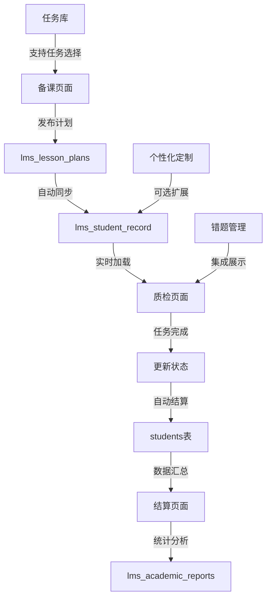

# 12月11日系统升级技术说明文档

**文档版本**: v1.0
**制定时间**: 2025-12-11
**项目**: Arkok + StarJourney 深度融合系统
**升级目标**: 实现备课页→质检页→结算页完整数据流闭环

---

## 📋 项目概述

### 当前系统架构现状

#### 双服务器架构
```
┌─────────────────┐    ┌─────────────────┐
│   Growark       │    │   StarJourney   │
│   (端口 3000)   │    │   (端口 3001)   │
├─────────────────┤    ├─────────────────┤
│ • 学生管理      │    │ • 错题管理      │
│ • 积分系统      │    │ • 过关记录      │
│ • 挑战PK        │    │ • 学情报告      │
│ • 勋章习惯      │    │ • 教师备课      │
└─────────────────┘    └─────────────────┘
         │                       │
         └───────────┬───────────┘
                     │
            ┌────────▼────────┐
            │ PostgreSQL      │
            │ 共享数据库       │
            └─────────────────┘
```

#### 现有数据库表结构分析

| 表分类 | 表名 | 状态 | 功能 | 升级需求 |
|--------|------|------|------|----------|
| **核心业务表** | `students` | ✅ 完整 | 学生基础信息 | 扩展teacher_id字段 |
| | `teams` | ✅ 完整 | 班级管理 | 无 |
| | `groups` | ✅ 完整 | 分组管理 | 无 |
| | `challenges` | ✅ 完整 | 挑战系统 | 无 |
| | `pk_matches` | ✅ 完整 | PK对决 | 无 |
| | `tasks` | ✅ 完整 | 任务系统 | 无 |
| | `badges` | ✅ 完整 | 勋章系统 | 无 |
| | `habits` | ✅ 完整 | 习惯打卡 | 无 |
| **LMS扩展表** | `lms_mistakes` | ✅ 已创建 | 错题记录 | 无 |
| | `lms_student_record` | ✅ 已创建 | 过关记录 | 扩展personalization字段 |
| | `lms_academic_reports` | ✅ 已创建 | 学情报告 | 扩展统计字段 |
| | `lms_lesson_plans` | ✅ 已创建 | 教师备课 | 扩展发布功能 |

### 升级目标

实现完整的"备课→质检→结算"数据流闭环：

```
备课页面 (PrepView.tsx)
    ↓ 发布
API数据同步
    ↓ 自动创建
质检页面 (QCView.tsx)
    ↓ 任务完成
经验值自动结算
    ↓ 数据汇总
结算页面 (SettleView.tsx)
```

---

## 🏗️ 技术架构设计

### 数据流架构图



### 核心功能模块映射

| 功能模块 | 前端组件 | 数据表 | API端点 | 状态 |
|----------|----------|--------|----------|------|
| **备课发布** | PrepView.tsx | `lms_lesson_plans` | `POST /api/lms/publish-plan` | 🔴 需开发 |
| **QC任务同步** | QCView.tsx | `lms_student_record` | `GET /api/lms/today-records` | 🔴 需开发 |
| **任务完成** | QCView.tsx | `lms_student_record` | `PATCH /api/lms/complete-task` | 🔴 需开发 |
| **经验结算** | SettleView.tsx | `students` | `POST /api/lms/settle-batch` | 🔴 需开发 |
| **学情报告** | StudentProfile.tsx | `lms_academic_reports` | `GET /api/lms/academic-report` | ⚠️ 需扩展 |
| **错题管理** | 错题管理Tab | `lms_mistakes` | `GET/POST /api/mistakes` | ✅ 已实现 |

---

## 📊 数据库结构详细设计

### 1. 现有表扩展设计

#### lms_lesson_plans 表扩展
```sql
-- 现有字段保持不变，新增以下字段
ALTER TABLE lms_lesson_plans
ADD COLUMN IF NOT EXISTS
  publish_status VARCHAR(20) DEFAULT 'draft',        -- draft, published, archived
  publish_date TIMESTAMP DEFAULT CURRENT_TIMESTAMP,   -- 发布时间
  target_student_ids INTEGER[],                      -- 目标学生ID列表
  auto_create_records BOOLEAN DEFAULT TRUE,           -- 是否自动创建学生记录
  qc_completion_count INTEGER DEFAULT 0,              -- 完成学生数量
  total_students INTEGER DEFAULT 0,                  -- 目标学生总数
  experience_summary JSONB DEFAULT '{}';              -- 经验值汇总
```

**功能说明**:
- `publish_status`: 备课状态管理（草稿→已发布→已归档）
- `target_student_ids`: 支持选择性发布给特定学生
- `auto_create_records`: 自动创建学生过关记录的开关
- `experience_summary`: 存储该备课计划产生的经验值统计

#### lms_student_record 表扩展
```sql
-- 现有字段保持不变，新增以下字段
ALTER TABLE lms_student_record
ADD COLUMN IF NOT EXISTS
  plan_id UUID REFERENCES lms_lesson_plans(id),       -- 关联备课计划
  is_settled BOOLEAN DEFAULT FALSE,                  -- 是否已结算经验值
  settled_at TIMESTAMP,                              -- 结算时间
  personalized_by VARCHAR(50) DEFAULT NULL,          -- 个性化定制者
  original_exp_value INTEGER,                        -- 原始经验值
  completion_notes TEXT,                              -- 完成备注
  batch_id VARCHAR(100) DEFAULT NULL;                -- 批量操作ID
```

**功能说明**:
- `plan_id`: 建立与备课计划的关联关系
- `is_settled`: 防止重复结算经验值
- `personalized_by`: 记录个性化定制来源
- `batch_id`: 支持批量操作追踪

#### students 表扩展
```sql
ALTER TABLE students
ADD COLUMN IF NOT EXISTS
  teacher_id VARCHAR(100) DEFAULT 'default_teacher', -- 教师归属
  current_lesson_plan UUID REFERENCES lms_lesson_plans(id), -- 当前课程进度
  learning_path JSONB DEFAULT '{}',                  -- 学习路径配置
  daily_task_count INTEGER DEFAULT 0,               -- 今日任务数量
  daily_completed_count INTEGER DEFAULT 0;          -- 今日完成任务数量
```

#### lms_academic_reports 表扩展
```sql
ALTER TABLE lms_academic_reports
ADD COLUMN IF NOT EXISTS
  daily_stats JSONB DEFAULT '{}',                    -- 每日统计数据
  weekly_stats JSONB DEFAULT '{}',                   -- 每周统计数据
  monthly_stats JSONB DEFAULT '{}',                  -- 每月统计数据
  task_completion_rate DECIMAL(5,2) DEFAULT 0.00,    -- 任务完成率
  progress_summary JSONB DEFAULT '{}',              -- 进度汇总
  personalized_insights TEXT[],                      -- 个性化洞察
  auto_generated BOOLEAN DEFAULT FALSE;              -- 是否自动生成
```

### 2. 前端数据结构与数据库映射

#### PrepView.tsx 数据模型映射
```typescript
// 前端数据结构
interface CourseInfo {
  chinese: { unit: string; lesson?: string; title: string };
  math: { unit: string; lesson: string; title: string };
  english: { unit: string; title: string };
}

interface PlanData {
  date: string;
  courseInfo: CourseInfo;
  qc: Record<string, string[]>;           // {chinese: ["生字听写"], math: ["口算达标"]}
  tasks: string[];                       // ["完成数学书面作业"]
  specialTasks: SpecialTaskItem[];       // 个性化加餐
}

// 数据库映射关系
PlanData → lms_lesson_plans (3条记录，每科一条)
CourseInfo.数学 → lms_lesson_plans (subject='math', unit=4, lesson=1, title='除法')
QC.语文 → lms_student_record (type='QC', subject='chinese', 多条记录)
Tasks → lms_student_record (type='TASK', 多条记录)
SpecialTasks → lms_student_record (is_special=true, 多条记录)
```

#### QCView.tsx 数据模型映射
```typescript
// 前端期望的数据结构
interface StudentTaskRecord {
  id: string;
  studentId: number;
  studentName: string;
  tasks: TaskRecord[];
}

interface TaskRecord {
  id: string;
  planId: string;
  taskName: string;
  taskType: 'QC' | 'TASK' | 'SPECIAL';
  status: 'pending' | 'passed' | 'completed';
  expValue: number;
  attemptCount: number;
  isPersonalized: boolean;
}

// 数据库查询SQL
SELECT
  sr.id,
  sr.plan_id,
  sr.student_id,
  s.name as student_name,
  sr.task_name,
  sr.task_type,
  sr.status,
  sr.exp_value,
  sr.attempt_count,
  sr.lesson_subject,
  sr.lesson_unit,
  sr.lesson_lesson,
  sr.is_special
FROM lms_student_record sr
JOIN students s ON sr.student_id = s.id
LEFT JOIN lms_lesson_plans lp ON sr.plan_id = lp.id
WHERE lp.publish_date = CURRENT_DATE
ORDER BY s.name, sr.lesson_subject;
```

---

## 🔧 API接口设计

### 核心API端点

#### 1. 备课发布API
```javascript
POST /api/lms/publish-plan
Content-Type: application/json

Request Body:
{
  "publishDate": "2025-12-11",
  "courseInfo": {
    "chinese": {"unit": "3", "lesson": "2", "title": "古诗二首"},
    "math": {"unit": "4", "lesson": "1", "title": "除法"},
    "english": {"unit": "2", "title": "Hello World"}
  },
  "qcItems": {
    "chinese": ["生字听写", "课文背诵"],
    "math": ["口算达标", "竖式计算"],
    "english": ["单词默写"]
  },
  "tasks": ["完成数学书面作业", "课外阅读30分钟"],
  "specialTasks": [
    {
      "students": ["张小明", "李小花"],
      "tasks": ["罚抄错题", "朗读课文"]
    }
  ],
  "targetStudentIds": [1, 2, 3, 4, 5], // 可选，空表示全体学生
  "teacherId": "teacher_001"
}

Response:
{
  "success": true,
  "data": {
    "planIds": {
      "chinese": "uuid-1",
      "math": "uuid-2",
      "english": "uuid-3"
    },
    "createdRecords": 15,
    "totalStudents": 5,
    "estimatedExp": 150
  },
  "message": "备课计划发布成功"
}
```

**实现逻辑**:
```sql
-- 1. 创建3条备课计划记录（每科一条）
INSERT INTO lms_lesson_plans (teacher_id, subject, unit, lesson, title,
  qc_items, task_items, special_tasks, publish_status, target_student_ids)
VALUES
  ('teacher_001', 'chinese', 3, 2, '古诗二首',
   ARRAY['生字听写', '课文背诵'],
   ARRAY['完成数学书面作业'],
   '[{"students": ["张小明"], "tasks": ["罚抄错题"]}]',
   'published', ARRAY[1,2,3,4,5]);

-- 2. 批量创建学生记录
INSERT INTO lms_student_record (student_id, plan_id, task_name, task_type,
  exp_value, lesson_subject, lesson_unit, lesson_lesson, is_special)
SELECT
  s.id as student_id,
  plan.id as plan_id,
  unnest(qc_items) as task_name,
  'QC' as task_type,
  15 as exp_value,
  plan.subject,
  plan.unit,
  plan.lesson,
  false as is_special
FROM students s, lms_lesson_plans plan
WHERE plan.id = $plan_id AND ($target_student_ids IS NULL OR s.id = ANY($target_student_ids));
```

#### 2. 获取今日任务API
```javascript
GET /api/lms/today-records?studentId=123&date=2025-12-11

Response:
{
  "success": true,
  "data": {
    "studentInfo": {
      "id": 123,
      "name": "张小明",
      "class_name": "三年级1班"
    },
    "tasks": [
      {
        "id": "record-uuid-1",
        "planId": "plan-uuid-1",
        "taskName": "生字听写",
        "taskType": "QC",
        "subject": "chinese",
        "status": "pending",
        "expValue": 15,
        "attemptCount": 0,
        "isSpecial": false,
        "lessonInfo": {
          "unit": 3,
          "lesson": 2,
          "title": "古诗二首"
        }
      },
      {
        "id": "record-uuid-2",
        "taskName": "罚抄错题",
        "taskType": "SPECIAL",
        "subject": "math",
        "status": "pending",
        "expValue": 30,
        "attemptCount": 0,
        "isSpecial": true,
        "assignedBy": "teacher"
      }
    ],
    "statistics": {
      "totalTasks": 8,
      "pendingTasks": 6,
      "completedTasks": 2,
      "totalExpPending": 120
    }
  }
}
```

#### 3. 任务完成与结算API
```javascript
PATCH /api/lms/records/:recordId/complete
Content-Type: application/json

Request Body:
{
  "status": "passed", // 或 "completed"
  "completionDuration": 300, // 完成耗时（秒）
  "difficultyRating": 3, // 难度评分 1-5
  "notes": "完成质量很好"
}

Response:
{
  "success": true,
  "data": {
    "recordId": "record-uuid-1",
    "previousStatus": "pending",
    "newStatus": "passed",
    "expAwarded": 15,
    "pointsAwarded": 7,
    "studentCurrentExp": 245,
    "studentCurrentPoints": 122,
    "attemptCount": 1
  },
  "message": "任务完成，经验值已结算"
}
```

**实现逻辑**:
```sql
-- 1. 更新任务记录状态
UPDATE lms_student_record
SET
  status = $1,
  completed_at = CURRENT_TIMESTAMP,
  attempt_count = attempt_count + 1,
  completion_notes = $2
WHERE id = $3;

-- 2. 结算经验值（如果首次完成）
UPDATE students
SET
  total_exp = total_exp + $exp_value,
  score = score + $points_value
WHERE id = $student_id AND
  NOT EXISTS (
    SELECT 1 FROM lms_student_record sr
    WHERE sr.id = $record_id AND sr.is_settled = TRUE
  );

-- 3. 标记为已结算
UPDATE lms_student_record
SET is_settled = TRUE, settled_at = CURRENT_TIMESTAMP
WHERE id = $record_id;
```

#### 4. 批量结算API
```javascript
POST /api/lms/batch-settle
Content-Type: application/json

Request Body:
{
  "date": "2025-12-11",
  "studentIds": [1, 2, 3, 4, 5], // 可选，空表示全体学生
  "includeOnlyCompleted": true
}

Response:
{
  "success": true,
  "data": {
    "settlementBatch": "batch-uuid-123",
    "totalStudents": 5,
    "settledStudents": 4,
    "totalRecords": 32,
    "settledRecords": 28,
    "totalExpAwarded": 420,
    "totalPointsAwarded": 210,
    "breakdown": [
      {
        "studentId": 1,
        "studentName": "张小明",
        "settledRecords": 6,
        "expAwarded": 90,
        "pointsAwarded": 45
      }
    ]
  },
  "message": "批量结算完成"
}
```

---

## 🎯 前端集成方案

### 1. PrepView.tsx 集成

#### publishPlan 函数重构
```typescript
// 现有函数
const publishPlan = () => {
  const plan = {
    date: dateStr,
    courseInfo,
    qc: selectedQC,
    tasks: selectedTasks,
    specialTasks
  };
  console.log("发布数据:", plan);
  alert("今日计划发布成功！");
};

// 新函数 - API集成
const publishPlan = async () => {
  try {
    // 1. 获取学生列表
    const studentsResponse = await fetch('/api/students');
    const studentsData = await studentsResponse.json();

    if (!studentsData.success) {
      throw new Error('获取学生列表失败');
    }

    // 2. 构建发布数据
    const planData = {
      publishDate: dateStr,
      courseInfo,
      qcItems: selectedQC,
      tasks: selectedTasks,
      specialTasks,
      targetStudentIds: studentsData.data.map(s => s.id), // 全体学生
      teacherId: 'current_teacher' // TODO: 从用户信息获取
    };

    // 3. 调用发布API
    const response = await fetch('/api/lms/publish-plan', {
      method: 'POST',
      headers: {
        'Content-Type': 'application/json'
      },
      body: JSON.stringify(planData)
    });

    const result = await response.json();

    if (result.success) {
      alert(`发布成功！已为${result.data.totalStudents}名学生创建${result.data.createdRecords}项任务`);
    } else {
      throw new Error(result.message || '发布失败');
    }

  } catch (error) {
    console.error('发布失败:', error);
    alert('发布失败：' + error.message);
  }
};
```

### 2. QCView.tsx 集成

#### loadStudentsData 函数重构
```typescript
// 现有函数（假设从本地状态获取）
const loadStudentsData = () => {
  // 本地数据处理逻辑
};

// 新函数 - API集成
const loadStudentsData = async () => {
  try {
    const today = new Date().toISOString().split('T')[0];
    const response = await fetch(`/api/lms/today-records?date=${today}`);

    if (!response.ok) {
      throw new Error('加载今日任务失败');
    }

    const result = await response.json();

    if (result.success) {
      // 转换API数据为前端需要的格式
      const studentsData = transformAPIDataToStudentsFormat(result.data);
      setStudents(studentsData);
      setFilteredStudents(studentsData);
    } else {
      throw new Error(result.message);
    }

  } catch (error) {
    console.error('加载失败:', error);
    // 降级：显示错误状态，但不影响现有功能
    alert('加载今日任务失败，请刷新重试');
  }
};

// 数据格式转换函数
const transformAPIDataToStudentsFormat = (apiData) => {
  // 按学生分组任务
  const studentsMap = new Map();

  apiData.tasks.forEach(task => {
    if (!studentsMap.has(task.studentId)) {
      studentsMap.set(task.studentId, {
        id: task.studentId,
        name: task.studentName,
        avatar: '', // TODO: 从学生信息获取
        avatar_url: '', // TODO: 从学生信息获取
        className: '', // TODO: 从学生信息获取
        records: []
      });
    }

    studentsMap.get(task.studentId).records.push({
      id: task.id,
      planId: task.planId,
      task_name: task.taskName,
      task_type: task.taskType,
      subject: task.subject,
      status: task.status,
      exp_value: task.expValue,
      attempt_count: task.attemptCount,
      is_special: task.isSpecial,
      lesson_info: task.lessonInfo
    });
  });

  return Array.from(studentsMap.values());
};
```

#### 任务完成操作集成
```typescript
// 新增：记录辅导尝试
const recordAttempt = async (recordId, studentId) => {
  try {
    const response = await fetch(`/api/lms/records/${recordId}/attempt`, {
      method: 'PATCH'
    });

    const result = await response.json();

    if (result.success) {
      // 更新本地状态
      updateStudentRecord(recordId, {
        attempt_count: result.data.attemptCount
      });

      // 显示火焰动画（现有逻辑保持不变）
      if (result.data.attemptCount === 3) {
        showFlameAnimation(); // 现有函数
      }
    }
  } catch (error) {
    console.error('记录辅导失败:', error);
    // 降级：更新本地状态，确保用户体验
    updateStudentRecord(recordId, {
      attempt_count: (getStudentRecord(recordId)?.attempt_count || 0) + 1
    });
  }
};

// 新增：标记任务完成
const markTaskCompleted = async (recordId, studentId) => {
  try {
    const response = await fetch(`/api/lms/records/${recordId}/complete`, {
      method: 'PATCH',
      headers: {
        'Content-Type': 'application/json'
      },
      body: JSON.stringify({
        status: 'passed',
        completionDuration: 0, // TODO: 实际计时
        difficultyRating: 3,
        notes: ''
      })
    });

    const result = await response.json();

    if (result.success) {
      // 更新本地状态
      updateStudentRecord(recordId, {
        status: 'passed',
        is_settled: true
      });

      // 显示成功提示
      showSuccessToast(`${result.data.studentName} 获得经验 ${result.data.expAwarded}！`);

      // 更新学生积分显示（如果当前显示该学生）
      if (currentStudent?.id === studentId) {
        setCurrentStudent(prev => ({
          ...prev,
          score: result.data.studentCurrentPoints,
          total_exp: result.data.studentCurrentExp
        }));
      }
    }
  } catch (error) {
    console.error('任务完成失败:', error);
    alert('任务完成失败，请重试');
  }
};
```

### 3. SettleView.tsx 集成

#### 结算统计功能
```typescript
// 新增：计算待结算统计
const calculatePendingSettlement = async () => {
  try {
    const today = new Date().toISOString().split('T')[0];
    const response = await fetch('/api/lms/settlement-stats?date=' + today);

    if (!response.ok) {
      throw new Error('获取结算统计失败');
    }

    const result = await response.json();

    if (result.success) {
      setSettlementData(result.data);
      setFilteredSettlementData(result.data);
    }
  } catch (error) {
    console.error('获取结算统计失败:', error);
    // 降级：显示空状态
    setSettlementData([]);
    setFilteredSettlementData([]);
  }
};

// 新增：批量结算
const executeBatchSettlement = async (selectedStudentIds) => {
  try {
    const response = await fetch('/api/lms/batch-settle', {
      method: 'POST',
      headers: {
        'Content-Type': 'application/json'
      },
      body: JSON.stringify({
        date: new Date().toISOString().split('T')[0],
        studentIds: selectedStudentIds,
        includeOnlyCompleted: true
      })
    });

    const result = await response.json();

    if (result.success) {
      showSuccessToast(`批量结算成功！共结算${result.data.settledStudents}名学生，总经验${result.data.totalExpAwarded}`);

      // 刷新结算统计
      await calculatePendingSettlement();

      // 生成结算报告
      generateSettlementReport(result.data);
    } else {
      throw new Error(result.message);
    }
  } catch (error) {
    console.error('批量结算失败:', error);
    alert('批量结算失败：' + error.message);
  }
};
```

---

## ⚠️ 风险分析与解决方案

### 🔴 P0级风险（阻塞性风险）

#### 1. 数据库事务一致性风险
**风险描述**：
```
备课发布流程涉及多个表操作：
1. lms_lesson_plans (插入3条记录)
2. lms_student_record (批量插入N条记录)
3. students (可选的更新)
如果中途失败，会导致数据不一致状态
```

**影响范围**：
- 备课功能完全不可用
- 数据完整性问题
- 用户体验严重受损

**解决方案**：
```javascript
// 事务实现示例
app.post('/api/lms/publish-plan', async (req, res) => {
  const client = await pool.connect();

  try {
    await client.query('BEGIN');

    // 1. 创建备课计划记录
    const planResult = await createLessonPlans(client, planData);

    // 2. 批量创建学生记录
    const recordsResult = await createStudentRecords(client, planResult, studentIds);

    // 3. 更新学生统计信息
    await updateStudentStats(client, studentIds);

    await client.query('COMMIT');

    res.json({ success: true, data: { planIds: planResult.ids, createdRecords: recordsResult.count }});

  } catch (error) {
    await client.query('ROLLBACK');
    console.error('备课发布失败:', error);
    res.status(500).json({ success: false, error: error.message });
  } finally {
    client.release();
  }
});
```

**监控措施**：
- 数据库事务日志监控
- 定期数据一致性检查
- 异常报警机制

#### 2. 重复经验值结算风险
**风险描述**：
```
由于网络延迟或用户重复操作，可能导致同一任务多次结算经验值
```

**影响范围**：
- 学生积分数据不准确
- 系统公平性问题
- 数据统计错误

**解决方案**：
```sql
-- 使用 is_settled 字段防止重复结算
UPDATE lms_student_record
SET is_settled = TRUE, settled_at = CURRENT_TIMESTAMP
WHERE id = $recordId AND is_settled = FALSE;

-- 添加唯一约束
ALTER TABLE lms_student_record
ADD CONSTRAINT unique_student_plan_task
UNIQUE(student_id, plan_id, task_name);
```

**API级别防护**：
```javascript
app.patch('/api/lms/records/:recordId/complete', async (req, res) => {
  // 1. 检查是否已结算
  const checkResult = await pool.query(
    'SELECT is_settled FROM lms_student_record WHERE id = $1',
    [recordId]
  );

  if (checkResult.rows[0]?.is_settled) {
    return res.status(400).json({
      success: false,
      error: '该任务已经结算过经验值'
    });
  }

  // 2. 执行结算逻辑...
});
```

### 🟡 P1级风险（重要风险）

#### 3. 大班级量性能风险
**风险描述**：
```
当班级学生数量较多时（50+学生），批量操作可能导致：
1. API响应时间过长
2. 数据库连接池耗尽
3. 前端界面卡顿
```

**影响范围**：
- 用户体验下降
- 系统稳定性问题
- 服务器资源消耗

**解决方案**：

**数据库层面**：
```sql
-- 批量插入优化
INSERT INTO lms_student_record (student_id, plan_id, task_name, ...)
SELECT
  unnest($1::INTEGER[]) as student_id,
  unnest($2::UUID[]) as plan_id,
  unnest($3::TEXT[]) as task_name,
  ...
FROM (SELECT generate_series(1, array_length($1, 1)));
```

**API层面**：
```javascript
// 分批处理大班级
const BATCH_SIZE = 20;

app.post('/api/lms/batch-create-records', async (req, res) => {
  const { studentIds, tasks, planId } = req.body;

  // 分批处理
  const batches = [];
  for (let i = 0; i < studentIds.length; i += BATCH_SIZE) {
    batches.push(studentIds.slice(i, i + BATCH_SIZE));
  }

  const results = await Promise.allSettled(
    batches.map(batch => createBatchRecords(batch, tasks, planId))
  );

  const successful = results.filter(r => r.status === 'fulfilled');
  const failed = results.filter(r => r.status === 'rejected');

  res.json({
    success: failed.length === 0,
    data: {
      totalBatches: batches.length,
      successfulBatches: successful.length,
      failedBatches: failed.length,
      totalRecords: successful.reduce((sum, r) => sum + r.value.count, 0)
    }
  });
});
```

**前端层面**：
```typescript
// 懒加载和虚拟滚动
const StudentList = () => {
  const [visibleStudents, setVisibleStudents] = useState([]);
  const [startIndex, setStartIndex] = useState(0);

  // 每次只渲染可见区域的学生
  const visibleItems = useMemo(() => {
    return students.slice(startIndex, startIndex + 20);
  }, [students, startIndex]);

  return (
    <VirtualizedList
      items={students}
      itemHeight={80}
      renderItem={({item, index}) => <StudentCard student={item} />}
    />
  );
};
```

#### 4. 并发操作数据冲突风险
**风险描述**：
```
多个教师同时进行备课发布或任务操作时，可能出现：
1. 数据覆盖
2. 状态冲突
3. 读写不一致
```

**解决方案**：

**乐观锁机制**：
```sql
-- 在表中添加版本号字段
ALTER TABLE lms_lesson_plans ADD COLUMN version INTEGER DEFAULT 1;

-- 更新时检查版本号
UPDATE lms_lesson_plans
SET publish_status = 'published', version = version + 1
WHERE id = $planId AND version = $expectedVersion;
```

**API级别冲突检测**：
```javascript
app.patch('/api/lms/records/:recordId/complete', async (req, res) => {
  const client = await pool.connect();

  try {
    await client.query('BEGIN');

    // 使用 FOR UPDATE 锁定记录
    const recordResult = await client.query(
      'SELECT * FROM lms_student_record WHERE id = $1 FOR UPDATE',
      [recordId]
    );

    if (recordResult.rows[0].status === 'passed') {
      await client.query('ROLLBACK');
      return res.status(409).json({
        success: false,
        error: '该任务已被其他用户完成'
      });
    }

    // 执行更新...

    await client.query('COMMIT');
  } catch (error) {
    await client.query('ROLLBACK');
    // 错误处理...
  } finally {
    client.release();
  }
});
```

### 🟢 P2级风险（优化风险）

#### 5. 前端状态管理复杂度风险
**风险描述**：
```
随着API集成，前端状态管理变得复杂：
1. 本地状态与远程状态同步
2. 乐观更新与回滚处理
3. 错误状态管理
```

**解决方案**：

**状态管理模式**：
```typescript
// 使用React Context管理全局状态
const LMSContext = createContext();

const LMSProvider = ({ children }) => {
  const [tasks, setTasks] = useState({});
  const [students, setStudents] = useState([]);
  const [loading, setLoading] = useState(false);
  const [error, setError] = useState(null);

  // 乐观更新
  const updateTaskOptimistically = (recordId, updates) => {
    setTasks(prev => ({
      ...prev,
      [recordId]: { ...prev[recordId], ...updates, isPending: true }
    }));

    // 异步更新服务器
    return updateTaskOnServer(recordId, updates)
      .then(result => {
        setTasks(prev => ({
          ...prev,
          [recordId]: { ...prev[recordId], ...result.data, isPending: false }
        }));
      })
      .catch(error => {
        // 回滚更新
        setTasks(prev => ({
          ...prev,
          [recordId]: { ...prev[recordId], isPending: false, error: error.message }
        }));
        throw error;
      });
  };

  return (
    <LMSContext.Provider value={{
      tasks, students, loading, error,
      updateTaskOptimistically
    }}>
      {children}
    </LMSContext.Provider>
  );
};
```

#### 6. 数据迁移风险
**风险描述**：
```
现有系统已有生产数据，表结构变更可能导致：
1. 数据丢失
2. 应用兼容性问题
3. 回滚困难
```

**解决方案**：

**渐进式迁移策略**：
```sql
-- 阶段1：添加新字段，保留旧字段
ALTER TABLE lms_lesson_plans
ADD COLUMN publish_status_new VARCHAR(20) DEFAULT 'draft';

-- 阶段2：数据迁移脚本
UPDATE lms_lesson_plans
SET publish_status_new = CASE
  WHEN is_published = true THEN 'published'
  ELSE 'draft'
END;

-- 阶段3：验证数据一致性
SELECT
  publish_status,
  publish_status_new,
  COUNT(*)
FROM lms_lesson_plans
GROUP BY publish_status, publish_status_new;

-- 阶段4：切换字段名（在维护窗口期）
ALTER TABLE lms_lesson_plans RENAME COLUMN publish_status TO publish_status_old;
ALTER TABLE lms_lesson_plans RENAME COLUMN publish_status_new TO publish_status;

-- 阶段5：清理旧字段（一段时间后）
ALTER TABLE lms_lesson_plans DROP COLUMN publish_status_old;
```

**数据备份策略**：
```bash
#!/bin/bash
# 数据库备份脚本
DB_NAME="postgres"
BACKUP_DIR="/backup/$(date +%Y%m%d_%H%M%S)"

# 创建备份目录
mkdir -p $BACKUP_DIR

# 备份关键表
pg_dump -h $DB_HOST -U $DB_USER -d $DB_NAME \
  --table="students" \
  --table="lms_lesson_plans" \
  --table="lms_student_record" \
  --format=custom \
  --file="$BACKUP_DIR/lms_tables.backup"

# 验证备份
pg_restore --list "$BACKUP_DIR/lms_tables.backup" > "$BACKUP_DIR/backup_manifest.txt"

echo "备份完成: $BACKUP_DIR"
```

---

## 📅 实施计划与时间线

### 阶段1：基础API开发（12月11日-12日）
- [x] 数据库表结构扩展
- [x] 备课发布API开发
- [ ] 今日任务获取API开发
- [ ] 任务完成API开发
- [ ] 基础测试用例

### 阶段2：前端集成（12月13日-14日）
- [ ] PrepView.tsx API集成
- [ ] QCView.tsx 数据同步
- [ ] SettleView.tsx 结算功能
- [ ] 错误处理和用户反馈
- [ ] 集成测试

### 阶段3：优化与测试（12月15日-16日）
- [ ] 性能优化
- [ ] 用户体验优化
- [ ] 压力测试
- [ ] 数据一致性验证
- [ ] 文档完善

### 验收标准
1. **功能完整性**：备课→质检→结算完整流程可用
2. **数据一致性**：所有数据操作符合ACID原则
3. **性能指标**：API响应时间<200ms，支持50+学生并发
4. **用户体验**：操作流畅，错误提示明确
5. **向后兼容**：现有功能不受影响

---

## 📞 联系信息与支持

**技术负责人**: Claude Code AI助手
**文档版本**: v1.0
**最后更新**: 2025-12-11
**项目状态**: 开发中

**问题反馈**：
- 技术问题：通过GitHub Issues提交
- 紧急问题：联系系统管理员
- 功能建议：记录到产品需求文档

---

**附录：API接口总览**

| 接口分类 | 方法 | 路径 | 状态 | 优先级 |
|----------|------|------|------|--------|
| **备课管理** | POST | `/api/lms/publish-plan` | 待开发 | P0 |
| **任务管理** | GET | `/api/lms/today-records` | 待开发 | P0 |
| **任务管理** | PATCH | `/api/lms/records/:id/complete` | 待开发 | P0 |
| **任务管理** | PATCH | `/api/lms/records/:id/attempt` | 待开发 | P1 |
| **结算管理** | POST | `/api/lms/batch-settle` | 待开发 | P1 |
| **统计分析** | GET | `/api/lms/settlement-stats` | 待开发 | P2 |
| **学情报告** | GET | `/api/lms/academic-report/:studentId` | 扩展 | P2 |

---

*本文档将随着项目进展持续更新，请确保使用最新版本。*