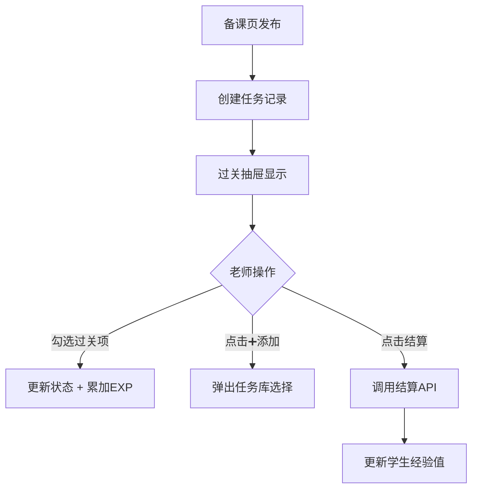

# 过关抽屉功能需求文档 (PRD)

## 1. 概述

### 1.1 功能目标
重构现有的"过关详情抽屉"，整合原"结算 Tab"功能，实现一站式过关操作。

### 1.2 用户场景
- 老师点击学生卡片 → 打开过关抽屉 → 勾选过关项 → 结算经验

---

## 2. UI 设计规范

严格遵守 `docs/UI_DESIGN_SYSTEM.md`：
- 背景：`bg-gray-50`
- 卡片：`bg-white rounded-2xl shadow-sm border border-gray-100`
- 主色：`bg-orange-500`（橙色强调）
- 圆角：`rounded-xl` / `rounded-2xl`

---

## 3. 抽屉结构


### 3.1 头部区域
| 元素 | 样式 |
|------|------|
| 学生姓名 | `text-xl font-extrabold text-slate-800` |
| 今日课程 | `text-xs text-gray-400` |
| 一键过关 | 绿色 pill 按钮 |
| 关闭按钮 | X 图标 |

### 3.2 三 Tab 切换
```
语文（橙色）| 数学（蓝色）| 英语（紫色）
```
- 激活态：`bg-orange-500 text-white`（语文示例）
- 非激活：`bg-gray-100 text-gray-600`

### 3.3 过关标签区
每个 Tab 下显示该学科的过关项（从备课页发布）：
- 未勾选：`bg-gray-100 text-gray-600`
- 已勾选：`bg-teal-500 text-white` + ✓ + "+5 EXP"

### 3.4 今日待办区（三区域）

| 区域 | 标识色 | 右上角按钮 |
|------|--------|-----------|
| 核心教学法 | 红色圆点 | ➕ 添加 |
| 综合成长 | 绿色圆点 | ➕ 添加 |
| 个性化辅导 | 紫色圆点 | 无（仅显示） |

每项使用 checkbox 样式：
- 未勾选：`☐ 任务名称`
- 已勾选：`☑ 任务名称 (+3)`

### 3.5 底部结算栏（固定）
```
[待结算] 15 EXP ✏️     [确认结算 ✓]
```
- EXP 数字可点击编辑
- 结算按钮：`bg-orange-500 text-white rounded-xl`

---

## 4. 数据流



---

## 5. API 接口

| 接口 | 方法 | 说明 |
|------|------|------|
| `/lms/daily-records` | GET | 获取学生当日任务 |
| `/lms/records/:id/status` | PATCH | 更新任务状态 |
| `/records/student/:id/pass-all` | PATCH | 结算经验 |

---

## 6. 删除项

- 删除：原"结算 Tab"（`activeTab === 'settle'` 分支）
- 保留：过关页主体 + 学生卡片列表
