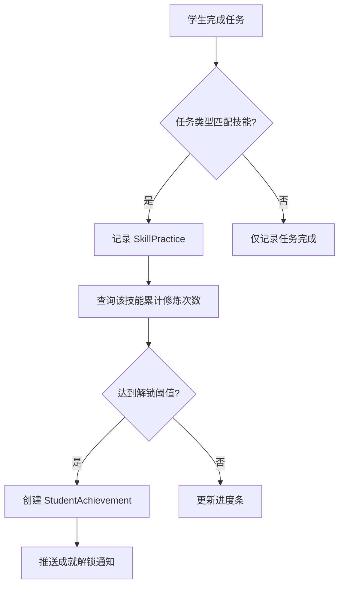

# 成就解锁与技能修炼系统规划

## 背景与目标

当前系统已具备习惯打卡、每日备课发布和任务完成的基础结构。但缺少一个"技能修炼"的进阶机制，让学生通过**刻意练习**特定学习方法/动作来解锁成就，并获得长期展示的技能点。

### 核心目标
1. 建立**技能库**：定义可修炼的学习技能（如试卷分析、知识点溯源、自助开花等）。
2. **修炼追踪**：记录学生每个技能的练习次数。
3. **成就解锁**：达到阈值自动解锁成就，授予技能点。
4. **能力面板**：长期展示学生已斩获的技能点和成就。

---

## 系统设计

### 1. 技能库定义 (Skill Registry)

| 技能ID | 技能名称 | 类型 | 描述 | 解锁阈值 |
|--------|----------|------|------|----------|
| `trial_analysis` | 试卷分析 | 学习方法 | 定位错误原因→知识点溯源→讲解 | 5次 |
| `knowledge_trace` | 知识点溯源 | 学习方法 | 从错题回溯到书本母题 | 5次 |
| `self_bloom` | 自助开花 | 学习方法 | 独立完成知识拓展与应用 | 3次 |
| `self_review` | 自我复盘 | 学习习惯 | 检查订正→总结规律 | 5次 |
| `weekly_plan` | 周计划制定 | 规划能力 | 制定每周学习/修炼计划 | 4次 |

> [!TIP]
> 技能库可由教师在后台动态配置，支持自定义技能名称、描述和解锁阈值。

### 2. 数据模型设计

```prisma
// 技能定义表
model Skill {
  id          String   @id @default(cuid())
  name        String   // 技能名称
  code        String   @unique // 唯一标识码
  category    String   // 类型：学习方法/学习习惯/规划能力
  description String?  // 描述
  unlockCount Int      @default(5) // 解锁所需次数
  iconUrl     String?  // 图标
  createdAt   DateTime @default(now())
  updatedAt   DateTime @updatedAt

  practices   SkillPractice[]
  achievements StudentAchievement[]
}

// 技能修炼记录表
model SkillPractice {
  id        String   @id @default(cuid())
  studentId String
  skillId   String
  taskId    String?  // 关联的任务ID（可选）
  note      String?  // 修炼笔记
  createdAt DateTime @default(now())

  student   Student  @relation(fields: [studentId], references: [id])
  skill     Skill    @relation(fields: [skillId], references: [id])
}

// 学生成就表
model StudentAchievement {
  id         String   @id @default(cuid())
  studentId  String
  skillId    String
  unlockedAt DateTime @default(now())
  level      Int      @default(1) // 成就等级（铜/银/金）

  student    Student  @relation(fields: [studentId], references: [id])
  skill      Skill    @relation(fields: [skillId], references: [id])

  @@unique([studentId, skillId])
}
```

### 3. 业务流程



### 4. 界面设计

#### 4.1 学生端 - 能力面板
- **已解锁技能**：展示全部已斩获的技能徽章。
- **修炼中技能**：显示进度条（如 2/5）。
- **技能详情**：点击查看修炼历史和提升建议。

#### 4.2 大屏端 - 成就达成区
- 在右侧下方"成就达成"预留区展示最新解锁的成就。
- 滚动播报：XX同学解锁了「试卷分析大师」成就！

#### 4.3 教师端 - 技能库管理
- 支持添加/编辑/删除技能定义。
- 支持为任务类型绑定关联技能。

---

## 实施阶段

### Phase 1: 基础架构 (1周)
- [ ] 创建数据库模型 (Skill, SkillPractice, StudentAchievement)
- [ ] 实现技能库 CRUD API
- [ ] 实现修炼记录 API

### Phase 2: 自动解锁逻辑 (3天)
- [ ] 任务完成时自动匹配技能并记录修炼
- [ ] 达到阈值时自动创建成就记录
- [ ] 推送解锁通知（大屏/学生端）

### Phase 3: 界面集成 (1周)
- [ ] 学生端能力面板 UI
- [ ] 大屏成就达成区对接
- [ ] 教师端技能库管理页

### Phase 4: 进阶功能 (可选)
- [ ] 成就等级系统（铜→银→金）
- [ ] 技能树可视化
- [ ] 每周修炼计划模板

---

## 待确认事项

1. **技能与任务的绑定方式**：是否由教师在发布任务时手动选择关联技能，还是系统根据任务类型自动匹配？
2. **解锁奖励**：解锁成就时是否同时奖励积分/经验？
3. **成就可视化**：是否需要设计专属的成就徽章图标？
