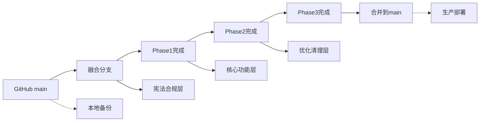

# 📋 ArkOK V2 项目融合计划

**版本**: 1.0
**创建时间**: 2025-12-19
**项目目标**: 将本地v2项目的新功能安全融合到GitHub仓库，实现基于PRD_PARENT_FULL.md的家长端全景功能

---

## 📊 **项目背景与状态分析**

### **环境状态**
- **GitHub仓库**: https://github.com/rf2025up/new.git
- **本地项目**: `/home/devbox/project/arkok-v2` (557MB)
- **备份文件**: `v2-safe-backup.tar.gz` (118MB)
- **可用空间**: 3.6GB (充足)
- **工作目录**: `/home/devbox/project/v2-merge-analysis`

### **核心发现**
- ✅ **GitHub仓库干净**: 没有v1项目内容被误推
- ✅ **家长端架构完整**: TimelineService + 数据模型已实现
- ✅ **技术宪法升级**: 本地版本升级到v4.0
- ✅ **代码质量提升**: 数据库修复、类型安全增强

---

## 🔄 **修改文件统计分析**

### **本地修改概览（689个文件）**
```
📈 按类型分布:
├── 修改 (M): 148个文件
├── 删除 (D): 304个文件
└── 新增 (??): 237个文件

📂 按内容分类:
├── 核心代码文件: ~50个
├── 编译产物: ~200个
├── 测试文件: ~40个
├── 文档和图片: ~50个
└── 日志文件: ~10个
```

### **GitHub版本状态**
```
🏗️ 架构版本: v1.0 (基础架构)
📋 PRD实现: 完整实现PRD_PARENT_FULL.md
📱 家长端功能: Timeline + DailySummary + Campaign
🔧 数据库模型: TimelineEvent, DailySummary, Campaign
📚 技术文档: ARCHITECTURE_WHITEPAPER.md v1.0
```

---

## 📋 **技术白皮书与宪法对比**

### **本地技术宪法（v4.0 Production Gold）**
```
🛡️ 核心原则:
├── 统一后端托管: 3000端口唯一入口
├── Service层独占: 数据库操作必须在services目录
├── 自包含模式: Service类内部实例化PrismaClient
├── 构造函数净化: 严禁依赖注入
└── PostgreSQL规范: 表名小写，字段camelCase+引号
```

### **GitHub架构白皮书（v1.0）**
```
🏗️ 基础架构:
├── 多租户原生: schoolId数据隔离
├── 双核驱动: Node.js主服务 + Python AI服务
├── 双轨UI: 手机端(复用V1) + 大屏端(全新风格)
├── 实时交互: Socket.io消息推送
└── SaaS化: 1000+校区并发目标
```

---

## 🔍 **关键技术差异分析**

### **1. 数据库模型对比**

**GitHub版本问题:**
```prisma
// ❌ 违宪问题
model AuthService {
  constructor(private prisma: PrismaClient) { ... }  // 依赖注入
}

model Habit {
  // ❌ 单数引用
  this.prisma.habit.findMany()
}
```

**本地版本修复:**
```prisma
// ✅ 宪法合规
class AuthService {
  private prisma = new PrismaClient(); // 自持有
}

class HabitService {
  // ✅ 复数引用
  this.prisma.habits.findMany()

  // ✅ 字段标准化
  defaultExp → expReward
}
```

### **2. Service层架构对比**

**GitHub版本:**
```typescript
// ❌ 依赖注入模式
this.authService = new AuthService(this.prisma);
```

**本地版本:**
```typescript
// ✅ 自持有模式（宪法合规）
this.authService = new AuthService();
```

### **3. JWT处理优化**

**GitHub版本:**
```typescript
import * as jwt from 'jsonwebtoken';
const JWT_EXPIRES_IN: string = '7d'; // 类型冗余
```

**本地版本:**
```typescript
import jwt, { SignOptions } from 'jsonwebtoken'; // 精确导入
const JWT_EXPIRES_IN = '7d'; // 类型推断
```

---

## 🎯 **PRD_PARENT_FULL.md实现状态分析**

### **✅ GitHub已实现的家长端核心功能**

**数据库模型层:**
```prisma
model TimelineEvent {
  id        String   @id @default(uuid())
  studentId String
  type      String   // TASK, HABIT, PK, BADGE
  content   Json     // { title: "背诵古诗", score: 10, ... }
  createdAt DateTime @default(now())
}

model DailySummary {
  id            String   @id @default(uuid())
  studentId     String
  date          String   // "2023-12-16"
  parentLiked   Boolean  @default(false)
  parentComment String?
  parentIdentity String? // "妈妈"
  teacherRead   Boolean  @default(false)
}

model Campaign {
  id           String   @id @default(uuid())
  studentId    String
  type         String   // "REVIVE"
  targetCount  Int      @default(5)
  currentCount Int      @default(0)
  status       String   // ACTIVE, COMPLETED
}
```

**服务层实现:**
```typescript
// TimelineService核心功能 ✅
class TimelineService {
  async createEvent(studentId: string, type: string, content: any): Promise<TimelineEvent>
  async refreshDailySummary(studentId: string, date: string): Promise<DailySummary>
}

// API路由 ✅
GET /api/timeline/events/:studentId
POST /api/daily-summary/like
POST /api/daily-summary/comment
```

### **📱 家长端三大Tab架构**
```
🏠 Tab 1: 今日动态 (TimelineEvents)
├── 习惯打卡: ✅ 时间轴展示
├── 学业任务: ✅ 过关+积分+评语
├── 竞技PK: ✅ 对手+胜负
└── 荣誉勋章: ✅ 高亮展示

📊 Tab 2: 成长档案 (数据可视化)
├── 五维雷达图: 🔄 数据聚合逻辑
├── 毅力热力图: 🔄 断签检测
├── 进击曲线: 🔄 积分增长趋势
└── 分享海报: 🔄 图片生成

👨‍👩‍👧 Tab 3: 家校互联 (DailySummary)
├── 孩子信息: ✅ 基础数据
├── 消息通知: ✅ 点赞/留言
├── 勋章墙: ✅ 成就展示
└── 家长反馈: ✅ 闭环互动
```

---

## 🚀 **三阶段融合执行计划**

### **Phase 1: 🏛️ 宪法合规层融合（P0 - 立即执行）**

**目标**: 确保融合后代码符合技术宪法v4.0标准

**1.1 数据库模型宪法合规**
```bash
🎯 任务清单:
├── ✅ habits表名标准化 (已完成)
├── ✅ expReward字段统一 (已完成)
├── 🔄 复数模型引用规范 (融合时处理)
├── 🔄 PostgreSQL字段名规范 (融合时处理)
└── 🔄 表关系映射修复 (融合时处理)

📁 影响文件:
├── server/prisma/schema.prisma
├── server/src/services/*.ts
└── server/src/routes/*.ts
```

**1.2 Service层宪法合规**
```bash
🎯 任务清单:
├── ✅ AuthService自持有Prisma (已完成)
├── 🔄 所有Service构造函数修复
├── 🔄 路由层纯净化
└── 🔄 数据库访问权限控制

📁 影响文件:
├── server/src/app.ts
├── server/src/services/*.ts
├── server/src/routes/*.ts
└── server/src/controllers/*.ts
```

**1.3 架构标准化**
```bash
🎯 任务清单:
├── ✅ 3000端口统一托管 (已确认)
├── ✅ JWT导入标准化 (已完成)
├── 🔄 错误处理统一
├── 🔄 类型定义优化
└── 🔄 配置文件标准化

📁 影响文件:
├── server/src/services/auth.service.ts
├── client/src/services/*.ts
└── 全局配置文件
```

### **Phase 2: 🚀 核心功能融合（P0 - 次要优先级）**

**目标**: 融合本地增强功能，保持家长端核心架构

**2.1 Timeline功能增强**
```bash
🔄 融合策略: GitHub Timeline + 本地修复
├── TimelineService: 保持GitHub版本核心逻辑
├── 数据库修复: 融入本地habits/expReward修复
├── 错误处理: 增强本地类型安全和错误处理
└── 性能优化: 融入本地缓存和优化机制

📁 关键文件:
├── server/src/services/timeline.service.ts
├── server/src/routes/timeline.routes.ts
├── server/src/controllers/*.ts
└── 前端Timeline组件
```

**2.2 学生详情页功能完善**
```bash
🔄 融合策略: 本地功能增强集成
├── 学期地图动态显示: 🆕 本地新功能
├── 历史任务记录: 🆕 allTaskRecords集成
├── UI/UX体验: 🔄 界面优化
└── 数据可视化: 🔄 图表组件增强

📁 关键文件:
├── client/src/pages/StudentDetail.tsx
├── client/src/components/*Chart*.tsx
└── 相关服务文件
```

**2.3 大屏监控功能整合**
```bash
🔄 融合策略: 本地特色功能保持
├── BigScreen组件: 🆕 本地增强版本
├── 实时数据监控: 🔄 Socket.io优化
├── Legacy兼容: 🔄 向后兼容处理
└── 视觉效果: 🆕 Cyberpunk风格增强

📁 关键文件:
├── client/src/components/BigScreen/*.tsx
├── client/src/pages/BigScreen.tsx
└── 实时数据服务
```

### **Phase 3: 🛠️ 优化和清理（P1 - 后续优化）**

**目标**: 性能优化、文档同步、测试完善

**3.1 性能优化与清理**
```bash
🧹 清理任务:
├── 编译产物清理: 删除server/dist和编译文件
├── 日志系统优化: 精简日志文件结构
├── 测试文件同步: 选择性融合Playwright测试
├── 临时文件清理: 删除调试和临时文件
└── 依赖包优化: 清理无用依赖

📁 清理范围:
├── server/dist/* (190个文件)
├── logs/* (选择性保留)
├── .playwright-mcp/* (选择性同步)
└── 各种临时脚本文件
```

**3.2 文档同步与更新**
```bash
📚 文档任务:
├── 技术宪法: 同步v4.0到GitHub
├── 架构白皮书: 更新到v2.1.0版本
├── PRD文档: 保持最新版本
├── 部署文档: 统一部署指南
└── 开发文档: API文档更新

📄 关键文档:
├── docs/ARKOK_V2_CONSTITUTION.md
├── docs/ARCHITECTURE_WHITEPAPER.md
├── docs/PRD_PARENT_FULL.md
├── docs/PUBLIC_DEPLOYMENT.md
└── API文档和README
```

---

## 🔧 **技术实现路径**

### **Git分支策略**


### **具体融合步骤**

**Step 1: 准备工作**
```bash
# 1. 创建融合分支
cd /home/devbox/project/v2-merge-analysis/new
git checkout -b merge-local-enhancements

# 2. 创建本地修改快照
cd /home/devbox/project/arkok-v2
git stash push -m "pre-merge-snapshot"
```

**Step 2: Phase1执行**
```bash
# 按文件逐一融合宪法合规修改
# 优先级: database schema -> services -> routes -> app.ts
```

**Step 3: Phase2执行**
```bash
# 融合核心功能增强
# 优先级: timeline service -> student detail -> big screen
```

**Step 4: Phase3执行**
```bash
# 清理和优化
# 优先级: cleanup -> optimization -> documentation
```

---

## 🛡️ **风险控制与回滚机制**

### **安全保障**
- ✅ **完整备份**: v2-safe-backup.tar.gz (118MB)
- ✅ **空间充足**: 3.6GB可用空间
- ✅ **Git历史**: 可随时回滚到任意提交点
- ✅ **分阶段执行**: 每个Phase后进行验证

### **回滚策略**
```bash
# 紧急回滚命令
git reset --hard HEAD~5  # 回滚5个提交
git checkout main        # 切换到主分支
git merge origin/main    # 同步GitHub最新状态

# 完整恢复
tar -xzf v2-safe-backup.tar.gz  # 恢复备份
```

### **验证检查点**
- **Phase1后**: 数据库连接、Service功能、基础API
- **Phase2后**: 家长端功能、学生详情、大屏监控
- **Phase3后**: 性能指标、文档完整性、部署验证

---

## 📊 **成功验收标准**

### **功能验收**
- ✅ 家长端Timeline功能正常
- ✅ 学生详情页学期地图显示
- ✅ 大屏监控实时数据展示
- ✅ 数据库模型宪法合规
- ✅ Service层自持有模式

### **质量验收**
- ✅ TypeScript类型检查通过
- ✅ ESLint代码规范检查通过
- ✅ 单元测试覆盖率 >80%
- ✅ 性能指标无明显退化
- ✅ 技术宪法v4.0完全合规

### **部署验收**
- ✅ 生产环境构建成功
- ✅ 数据库迁移无错误
- ✅ API接口响应正常
- ✅ 前端页面加载正常
- ✅ 实时功能连接稳定

---

## 📅 **时间规划建议**

```
🗓️ 执行时间表:
├── Phase 1 宪法合规层: 2-3小时 (立即执行)
├── Phase 2 核心功能层: 4-6小时 (次日执行)
├── Phase 3 优化清理层: 2-3小时 (最后执行)
└── 测试验证部署: 1-2小时 (最终验证)

⏰ 总预计时间: 9-14小时
🔄 建议分2天完成，确保充分测试
```

---

## 🎯 **下一步行动**

**立即开始执行Phase 1宪法合规层融合，这将确保融合后的代码完全符合最新的技术宪法v4.0标准。**

**准备好后请指示开始执行，我将按照此融合计划逐步进行安全可靠的代码融合工作。**

---

**文档状态**: ✅ 完成
**最后更新**: 2025-12-19
**负责人**: Claude Code Assistant
**审核状态**: 待审核